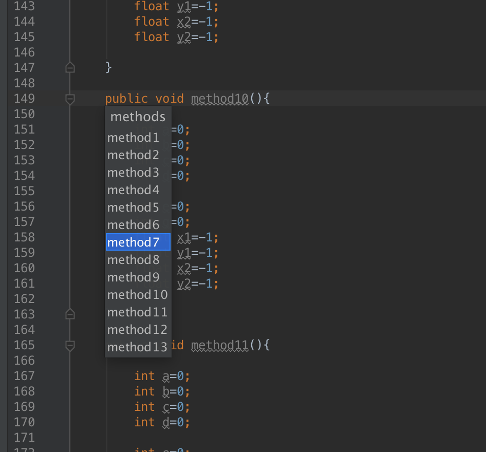
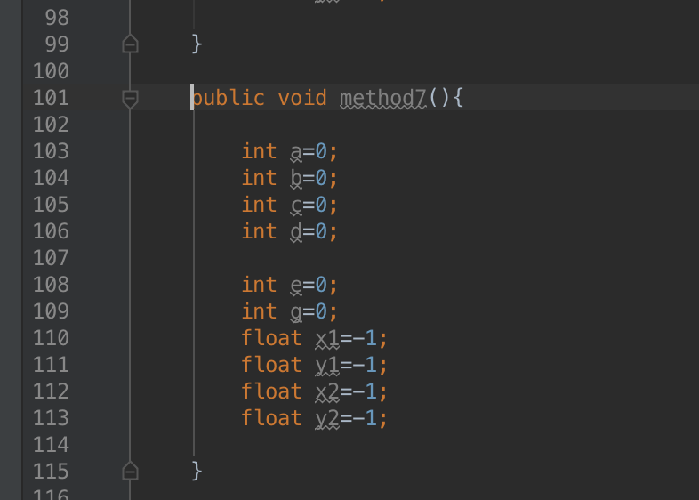

MethodView
========

A plugin for Android Studio and Intellij IDEA that can quick view method you edit the class.

* it is only support the newest jdk like 8 or more

Usage
=====

Quick Operations Popup
-----------------

The number on the left is a shortcut that will do the same way to this plugin

* Windows/Linux/Mac: Alt+M

The Menu Way
------------
You can find every command in the following menu:
`View->MethodViewer` 

Installation
========

Download the jar in there and 
`Preferences/Settings->Plugins->Install plugin from disk` 

Apache License
